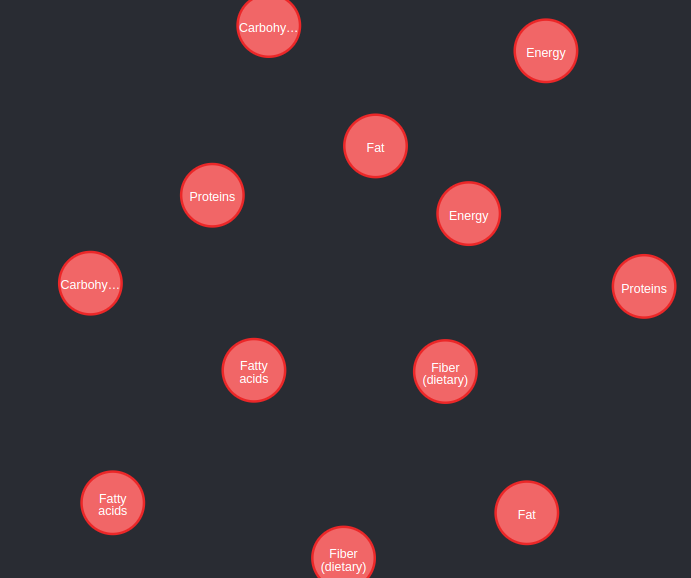
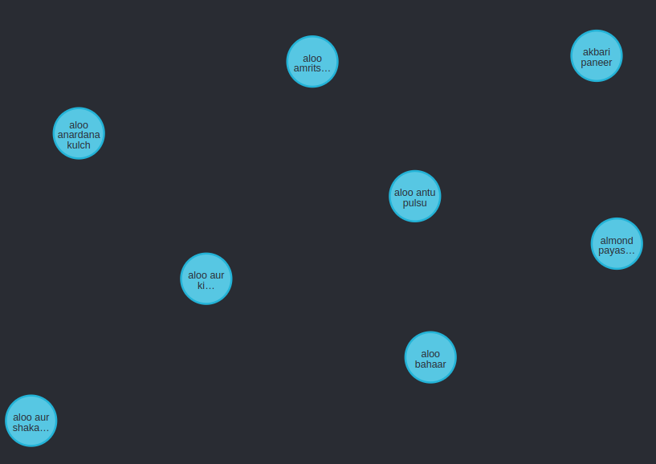
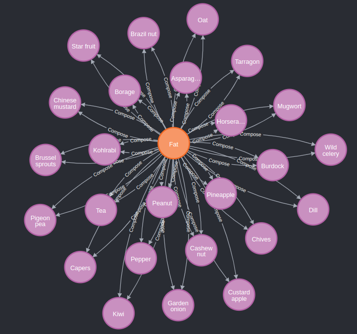
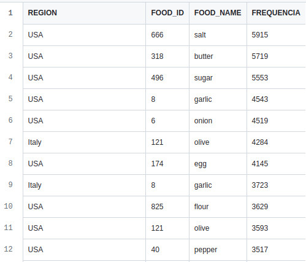
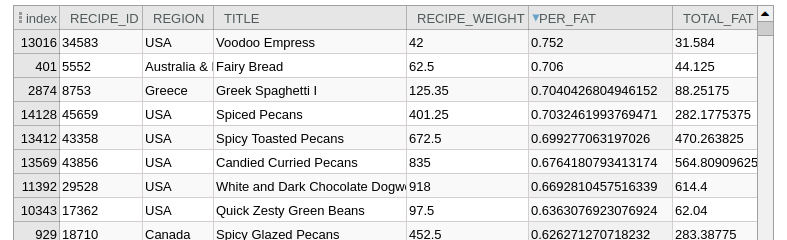
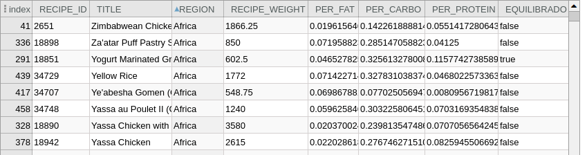

# Modelo de Apresentação da Final

# Modelo para Apresentação da Entrega Final do Projeto

## Motivação e Contexto

> O projeto proposto tem como foco central a investigação da composição e análise das receitas culinárias de diferentes regiões do mundo, visando compreender e mapear os macronutrientes presentes em cada prato. A motivação por trás desse estudo concentra-se na crescente conscientização sobre a importância da alimentação para a saúde, bem como na compreensão da diversidade gastronômica global. Dessa maneira, este projeto visa também entender como a concentração de determinado macronutriente se relaciona com os hábitos alimentares, contexto histórico e geográfico de cada região, contribuindo para uma compreensão mais profunda da relação entre alimentação e saúde.

## Slides

### Apresentação Prévia
> [Link da Apresentação Prévia](../project-1/projeto1-mc536.pdf)

### Apresentação Final
> [Link da Apresentação Final](docs/Apresentacao-Projeto-Final.pdf)

## Modelo Conceitual

> 

## Modelos Lógicos

- Modelo Lógico Relacional
~~~
Nutrient(_ID_, Public_id, Nutrient_name)

Food(_ID_, Public_id, Food_name, description, food_group, food_subgroup)

Nutrient_On_Food(_ID_, nutrient_ID, food_ID, Orig_Content, unit, quantity_Ref)
  nutrient_ID: chave estrangeira para Nutrient
  food_ID: chave estrangeira para Food

Recipes(_Recipe_ID_, Title, Region)

Units(_Unit_Name_, grams)

Ingredients(_Recipe_ID_, _Food_ID_, quantity, food_name, unit)
  Recipe_ID: chave estrangeira para Recipes
  Food_ID: chave estrangeira para Food
  Unit: chave estrangeira para Units
~~~

- Modelo Lógico de Grafos
> 

## Dataset Publicado

título do arquivo/base | link | breve descrição
----- | ----- | -----
`Recipes` | [data/interim/Recipes.csv](https://github.com/lamevv/projeto/blob/main/project-2-final/data/interim/Recipes.csv) | `Informações das receitas, incluindo a descrição da receita e a região à qual ela pertence`
`ProcessedNutrient` | [data/interim/ProcessedNutrient.csv](https://github.com/lamevv/projeto/blob/main/project-2-final/data/interim/ProcessedNutrient.csv) | `Especificação e descrição dos nutrientes considerados na análise da composição dos ingredientes`
`Units-Conversion` | [data/interim/Units-Conversion.csv](https://github.com/lamevv/projeto/blob/main/project-2-final/data/interim/Units-Conversion.csv) | `Unidades de medida adotadas para a análise da composição de cada ingrediente em uma receita, acompanhada de seus valores padrão expressos em gramas`
`IngredientOnFood` | [data/interim/IngredientOnFood.csv](https://raw.githubusercontent.com/lamevv/projeto/main/project-2-final/data/interim/IngredientOnFood.csv) | `Detalhamento da composição de cada receita, listando ingredientes acompanhados de suas respectivas quantidades e unidade de medida`
`ProcessedContent` | [data/interim/ProcessedContent.csv](https://github.com/lamevv/projeto/blob/main/project-2-final/data/interim/ProcessedContent.csv) | `Avalia a concentração específica de nutrientes em cada ingrediente para uma quantidade de referência`
`MostFrequentIngredients` | [data/processed/MostFrequentIngredients.csv](https://github.com/lamevv/projeto/blob/main/project-2-final/data/processed/MostFrequentIngredients.csv) | `Exibe a frequência de ocorrência dos alimentos mais comuns em receitas de cada uma das regiões definidas pelo CulinaryDB`
`RecipeProfile` | [data/processed/RecipeProfile.csv](https://raw.githubusercontent.com/lamevv/projeto/main/project-2-final/data/processed/RecipeProfile.csv) | `Apresenta o perfil de cada receita em termos de macronutrientes (proteínas, carboidratos e gorduras), identificando aquelas que são nutricionalmente equilibradas`
`RegionalNutricionalProfile` | [data/processed/RegionalNutricionalProfile.csv](https://github.com/lamevv/projeto/blob/main/project-2-final/data/processed/RegionalNutricionalProfile.csv) | `Dispõe o perfil nutricional em termos de macronutrientes (proteínas, carboidratos e gorduras) das regiões definidas pelo CulinaryDB`
`food-graphs` | [data/graphs/food-graphs.csv](https://github.com/lamevv/projeto/blob/main/project-2-final/data/graphs/food-graphs.csv) | `Dispõe dos campos "id" e "name" da tabela Food. Tem como principal objetivo minimizar o volume de dados na criação do banco de dados em grafos`
`nutrient-graphs` | [data/graphs/nutrient-graphs.csv](https://github.com/lamevv/projeto/blob/main/project-2-final/data/graphs/nutrient-graphs.csv) | `Dispõe dos campos "id" e "name" da tabela Nutrient. Tem como principal objetivo minimizar o volume de dados na criação do banco de dados em grafos`

## Bases de Dados

título da base | link | breve descrição
----- | ----- | -----
`FooDB` | <a href='https://foodb.ca'>`https://foodb.ca`</a> | `Descrição nutricional em macro e micronutrienes dos ingredientes`
`CulinaryDB` | <a href='https://cosylab.iiitd.edu.in/culinarydb/'>`https://cosylab.iiitd.edu.in/culinarydb`</a> | `Composição de receitas regionais, detalhando ingredientes e suas quantidades correspondentes`

## Detalhamento do Projeto

### Pré-processamento

- Transformação e adequação dos dados das receitas do `CulinaryDB`

A fim de criar a tabela `Recipes.csv`, foram executadas etapas de filtragem e renomeação das colunas, selecionando informações relevantes para as análises planejadas. Além disso, houve a modificação de certos valores, visando à normalização e padronização dos dados referentes às diferentes regiões associadas às receitas.

~~~python
import pandas as pd

# Leitura da tabela de receitas do CulinaryDB através de um DataFrame
df_recipes = pd.read_csv('../data/raw/culinarydb/01_Recipe_Details.csv', sep=',', header=0, encoding='UTF-8')

# Filtragem e renomeação das colunas com informações relevantes
df_recipes = df_recipes.rename(columns={'Cuisine': 'Region'})[['Recipe ID', 'Title', 'Region']]

# Padronização/Normalização de regiões específicas
df_recipes['Region'] = df_recipes['Region'].apply(lambda x: x.replace('Misc.: ', ''))
df_recipes['Region'] = df_recipes['Region'].apply(lambda x: x.replace('DACH Countries', 'Germany, Austria, and Switzerland'))

# Exportação dos dados processados para o formato csv (Recipes.csv)
df_recipes.to_csv('../data/interim/Recipes.csv', index=False)
~~~

- Tratamento dos dados da composição das receitas do `CulinaryDB`

A tabela [04_Recipe-Ingredients_Aliases](https://raw.githubusercontent.com/lamevv/projeto/main/project-2-final/data/raw/culinarydb/04_Recipe-Ingredients_Aliases.csv) do `CulinaryDB` não segue uma padronização específica para apresentar a participação de um ingrediente em uma dada receita, condensando toda essa informação em um texto no atributo `Original Ingredient Name`. Alguns dos formatos apresentados são: *3/4 cup mayonnaise*, *1 tablespoon butter*, *2 (4 ounce) skinless, boneless chicken breast halves*, *1 1/2 pounds ground beef*, entre outros. 

Desse modo, no notebook [units-of-measurement-data](https://github.com/lamevv/projeto/blob/main/project-2-final/notebooks/units-of-measurement-data.ipynb) foram realizadas uma série de extrações e normalizações para identificar a **quantidade** e **unidade de medida** referentes a participação dos ingredientes nas receitas. Além disso, o *notebook* detalha a elaboração da **tabela de unidades de medida**, em que cada unidade selecionada possui uma equivalência padrão em gramas, simplificando e padronizando o processo de verificação da presença dos ingredientes nas receitas. Assim, no final do tratamento dos dados, duas novas tabelas foram criadas `Recipe-Ingredients-With-Quantity.csv` e `Units-Conversion.csv`.

- Integração dos dados de ingredientes do `FooDB` com o `CulinaryDB`

Inicialmente, importamos as tabelas de ingredientes por meio de *DataFrames*, as quais seriam integradas.

~~~python
import pandas as pd

# Importação dados processados com quantidade e unidade de medida dos ingredientes nas receitas (CulinaryDB)
df_with_unit = pd.read_csv('../data/interim/Recipe-Ingredients-With-Quantity.csv', sep=',', header=0, encoding='UTF-8')

# Renomeação das colunas
df_with_unit = df_with_unit.rename(columns={'Recipe ID': 'Recipe_ID', 'Original Ingredient Name': 'Original_Ingredient_Name', 'Aliased Ingredient Name': 'Aliased_Ingredient_Name', 'Entity ID': 'Entity_ID'})

# Importação da tabela Food.csv com os dados dos ingredientes do FooDB
df_food = pd.read_csv('Food.csv', sep=',', header=0, encoding='UTF-8')

# Filtragem das colunas com informações relevantes para a integração
df_food = df_food[['id', 'name']]
~~~

Para criar a coluna `Food_ID` no arquivo das receitas, foi necessário iterar por cada linha do `Recipe-Ingredients-With-Quantity` e verificar se o ingrediente da linha tinha correspondência com algum alimento do `FoodDB`. Se houvesse uma correspondência, o ID do alimento seria retornado; caso contrário, seria retornado `None`. Alguns alimentos não encontraram correspondência e, consequentemente, ficaram com `NaN` na coluna `Food_ID`, levando à exclusão desses registros.

~~~python
def get_food_id(food_name):
    filtered = df_food[df_food['name'].str.contains(food_name, case=False)]
    if not filtered.empty:
        return filtered.iloc[0]['id']
    return None

df_with_unit['Food_ID'] = df_with_unit['Aliased_Ingredient_Name'].apply(get_food_id)

# Filtragem das colunas com informações relevantes e exclusão dos registros com NaN
df_with_unit = df_with_unit.dropna()[['Recipe_ID', 'Food_ID', 'Aliased_Ingredient_Name', 'Quantity', 'Unit']]

# Exportação dos dados processados para o formato csv (IngredientOnFood.csv)
df_with_unit.to_csv('../data/interim/IngredientOnFood.csv', index=False)
~~~

### Banco de dados em Grafos
Para realizar a construção do banco de dados em grafos, foi necessário filtrar as colunas das tabelas utilizadas, com o objetivo de reduzir o contingente de memória carregado `Neo4j`.
Dessa forma, reduzimos as colunas das tabelas `Food` e `Nutrient` (que possuíam vários atributos) para `id` e `name`.
~~~python
import pandas as pd
# Importação das tabelas Food e Nutrient
df_food = pd.read_csv('../raw/foodb/Food.csv', sep=',', header=0, encoding='UTF-8')
df_nutrient = pd.read_csv('../raw/foodb/Nutrient.csv', sep=',', header=0, encoding='UTF-8')

# Filtragem das colunas, selecionando os atributos "id" e "name"
df_food = df_food[['id', 'name']]
df_nutrient = df_nutrient[['id', 'name']]

# Exportação dos dados para o formato csv (nutrient-graphs.csv e food-graphs.csv)
df_food.to_csv('food-graphs.csv', index=False)
df_nutrient.to_csv('nutrient-graphs.csv', index=False)
~~~
Assim, criamos um nó do tipo `Food` baseado na tabela `food-graphs.csv`, e definimos o `id` como índice do nó:
~~~cypher
LOAD CSV WITH HEADERS FROM 'https://raw.githubusercontent.com/lamevv/projeto/main/project-2-final/data/graphs/food-graphs.csv' AS line
CREATE (:Food {id: line.id, name: line.name})

CREATE INDEX FOR (f:Food) ON (f.id)
~~~
Ao listar os nós, obtivemos a seguinte visualização:
~~~cypher
MATCH (n:Food) RETURN n LIMIT 25
~~~

Criamos um nó do tipo `Nutrient` baseado na tabela `nutrient-graphs.csv`, e definimos o `id` como índice do nó:
~~~cypher
LOAD CSV WITH HEADERS FROM 'https://raw.githubusercontent.com/lamevv/projeto/main/project-2-final/data/graphs/nutrient-graphs.csv' AS line
CREATE (:Nutrient {id: line.id, name: line.name})

CREATE INDEX FOR (n:Nutrient) ON (n.id)
~~~
Ao listar os nós, obtivemos a seguinte visualização:
~~~cypher
MATCH (n:Nutrient) RETURN n LIMIT 25
~~~

Criamos um nó do tipo `Recipes` baseado na tabela `Recipes.csv`, e definimos o `id` como índice do nó:
~~~cypher
LOAD CSV WITH HEADERS FROM 'https://raw.githubusercontent.com/lamevv/projeto/main/project-2-final/data/interim/Recipes.csv' AS line
CREATE (:Recipes {id: line.Recipe_ID, name: line.Title, region: line.Region})

CREATE INDEX FOR (r:Recipes) ON (r.id)
~~~
Ao listar os nós, obtivemos a seguinte visualização:
~~~cypher
MATCH (n:Recipes) RETURN n LIMIT 25
~~~

Além disso, construímos a relação `Compose` entre os nós dos tipos `Food` e `Nutrient` conforme o modelo lógico apresentado:
~~~cypher
LOAD CSV WITH HEADERS FROM 'https://raw.githubusercontent.com/lamevv/projeto/main/project-2-final/data/interim/ProcessedContent.csv' AS line
MATCH (f:Food {id: line.food_id})
MATCH (n:Nutrient {id: line.source_id})
CREATE (n)-[r:Compose {id: line.id}]->(f)
SET r.orig_content = line.orig_content,
    r.unit = line.unit,
    r.quantity_ref = line.quantity_ref
~~~

E também, construímos a relação Produces entre nós dos tipos Food e Recipes:
~~~cypher
LOAD CSV WITH HEADERS FROM 'https://raw.githubusercontent.com/lamevv/projeto/main/project-2-final/data/interim/IngredientOnFood2.csv' AS line
MATCH (f:Food {id: line.Food_ID})
MATCH (r:Recipes {id: line.Recipe_ID})
CREATE (f)-[p:Produces {id: line.id}]->(r)
SET p.quantity = line.quantity,
    p.unit = line.unit
~~~

## Evolução do Projeto

Durante a construção do projeto, encontramos diversos desafios associados aos processamentos de dados, perguntas a serem implementadas, queries (SQL e Cypher), entre outros fatores. Dentre eles, elencamos alguns:
* **Formato dos dados no CulinaryDB**: a tabela [04_Recipe-Ingredients_Aliases](https://raw.githubusercontent.com/lamevv/projeto/main/project-2-final/data/raw/culinarydb/04_Recipe-Ingredients_Aliases.csv) apresenta os alimentos presentes em cada nutriente e sua quantidade. No entanto, o valor da quantidade do alimento e a unidade de medida estavam juntos dentro do atributo `Original Ingredient Name` em formato de string. Além disso, não havia padronização na forma com que estes dados apareciam na string. As quantidades apareciam no texto no formato fracionário '1/2', ou no formato decimal '0.5', ou no formato unitário 'cup'. As unidades de medida não eram apresentadas em uma tabela separada. Por isso, tivemos que utilizar um código em python que identificasse as possíveis unidades de medidas, e criamos uma tabela para armazená-las. Assim como para unidades de medidas, também criamos um código para identificar as possíveis formas com que a quantidade eram apresentadas, e padronizamos para o formato decimal. Dessa forma, a partir destes códigos, criamos a tabela [Units-Conversion.csv](https://raw.githubusercontent.com/lamevv/projeto/main/project-2-final/data/interim/Units-Conversion.csv)
* **Integração entre bases**: a tabela de alimentos presente na base do `CulinaryDB` era consideravalmente escassa e não possuia detalhamento dos nutrientes, por isso, tivemos que utilizar a tabela [Food.csv](https://raw.githubusercontent.com/lamevv/projeto/main/project-2-final/data/raw/foodb/Food.csv) do `FooDB`. No entanto, a tabela [04_Recipe-Ingredients_Aliases](https://raw.githubusercontent.com/lamevv/projeto/main/project-2-final/data/raw/culinarydb/04_Recipe-Ingredients_Aliases.csv), que continha os ingredientes presentes em cada receita, utilizava o atributo `Entity_ID` para se referir a ID do alimento na tabela [02_Ingredients.csv](https://raw.githubusercontent.com/lamevv/projeto/main/project-2-final/data/raw/culinarydb/02_Ingredients.csv). Por isso, tivemos que criar um código em python para criar uma nova coluna `Food_ID` na tabela, que fizesse referência aos alimentos da tabela [Food.csv](https://raw.githubusercontent.com/lamevv/projeto/main/project-2-final/data/raw/foodb/Food.csv), fato que nos custou muito tempo de processamento.
* **Perguntas implementadas**: ao longo do processo de construção do projeto, encontramos algumas limitações associadas aos dados e a forma com que eles eram apresentados. Dessa forma, tivemos que mudar algumas perguntas implementadas para perguntas que fossem mais compatíveis com o modelo estruturado.
* **Queries SQL**: para realizar as queries SQL que responderiam as perguntas implementadas, tentamos utilizar VIEW's. No entanto, para algumas tabelas de junção, o volume de dados era muito grande, o que tornava inviável este tipo de abordagem. Por isso, tivemos que criar tabelas específicas para possibilitar o acesso de algumas informações. Por exemplo, a tabela `RecipeProfile`, que mostra a quantidade de proteína, carboidrato gordura em uma receita, foi criada a fim de evitar o uso de VIEW.
* **Queries Cypher**: ao tentar fazer o carregamento de algumas tabelas para criar nós no Cypher, obtivemos erro relacionados a formatações de alguns atributos textuais. Por isso, tivemos que criar novas tabelas com colunas filtradas, eliminando as inconsistências apontadas.

## Perguntas de Pesquisa/Análise Combinadas e Respectivas Análises

### Perguntas/Análise com Resposta Implementada

O conjunto das *queries* e análises apresentadas abaixo estão detelhadas no *notebook* [nutricional-profile-analysis](notebooks/nutricional-profile-analysis.ipynb).

#### Pergunta/Análise 1
> * Quais são os alimentos mais presentes nas receitas de cada região?
>   
>   * Utilizando funções de agregamento, descobrimos o quão frequente é um ingrediente na composição dos alimentos de uma região. Dessa forma, definindo-se os parâmetros, pegamos aqueles que tinham frequências acima da média das frequências relacionadas à cada região. O resultado foi que obtivemos alimentos que são muito populares, como ovo, pão e água.

~~~SQL
DROP VIEW IF EXISTS MostFrequentIngredients;

CREATE VIEW MostFrequentIngredients AS
SELECT F.Region, I.Food_Id, I.Food_Name, COUNT(Food_Id) frequencia
    FROM (SELECT Region, AVG(frequencia) std_frequencia, STDDEV(frequencia) desvpad_frequencia
                FROM (SELECT Region, Food_Id, COUNT(Food_Id) frequencia
                      FROM Recipes R JOIN Ingredients I ON R.Recipe_Id = I.Recipe_Id
                      GROUP BY Region, Food_Id
                      ORDER BY Region, frequencia DESC) F
          GROUP BY Region) F, Recipes R, Ingredients I
    WHERE  R.Region = F.Region AND R.Recipe_Id=I.Recipe_Id
    GROUP BY F.Region, I.Food_Id, I.Food_Name
    HAVING COUNT(Food_Id) >= std_frequencia + desvpad_frequencia
    ORDER BY frequencia DESC;
~~~

Amostra do resultado da Pergunta/Análise 1, com resultado completo apresentado no arquivo [MostFrequentIngredients](https://github.com/lamevv/projeto/blob/main/project-2-final/data/processed/MostFrequentIngredients.csv):

#### Pergunta/Análise 2
> * Quais os alimentos e receitas que mais contribuem para a ingestão de açúcares, gorduras e proteínas para cada região?
>   
>   * Traçamos um perfil nutricional de cada receita, que contém informações dos macronutrientes (proteínas, gorduras e carboidratos) presentes. A partir disso, podemos filtrar receitas com altos teores desses macronutrientes, de acordo com a região.

~~~SQL
CREATE TABLE Recipe_Profile (
    Recipe_Id INT NOT NULL,
    weight FLOAT DEFAULT 0,
    fat FLOAT DEFAULT 0,
    carbo FLOAT DEFAULT 0,
    protein FLOAT DEFAULT 0,
    PRIMARY KEY(Recipe_Id),
    FOREIGN KEY(Recipe_Id)
        REFERENCES Recipes(Recipe_Id)
            ON UPDATE NO ACTION
            ON DELETE NO ACTION
);
~~~

~~~SQL
UPDATE Recipe_Profile RP
SET RP.fat = (SELECT COALESCE(SUM(RIF.fat), 0) FROM RecipeIngredientFat RIF WHERE RIF.Recipe_Id = RP.Recipe_Id),
    RP.protein = (SELECT COALESCE(SUM(RIP.protein), 0) FROM RecipeIngredientProtein RIP WHERE RIP.Recipe_Id = RP.Recipe_Id),
    RP.carbo = (SELECT COALESCE(SUM(RIC.carbo), 0) FROM RecipeIngredientCarbo RIC WHERE RIC.Recipe_Id = RP.Recipe_Id),
    RP.weight = (SELECT COALESCE(SUM(RI.qnt_grams), 0) FROM RecipeIngredients RI WHERE RI.Recipe_Id = RP.Recipe_Id);
~~~

Amostra do resultado da Pergunta/Análise 2, com resultado completo apresentado no arquivo [RecipeProfile](https://raw.githubusercontent.com/lamevv/projeto/main/project-2-final/data/processed/RecipeProfile.csv):

#### Pergunta/Análise 3
> * Quais são as receitas mais equilibradas em termos de macronutrientes (proteínas, gorduras e carboidratos) para cada região? 
>   
>   * Através do perfil nutricional de cada receita, podemos definir se a receita é balanceada com base em parâmetros padrões de proteínas, gorduras e carboidratos. Na nossa análise, consideramos balanceado uma receita que seja composta com até 10% de gordura, 50% de carboidrato e pelo menos 10% de proteína.

~~~SQL
DROP VIEW IF EXISTS RecipeProfileComplete;

CREATE VIEW RecipeProfileComplete AS
SELECT R.Recipe_Id, R.Title, R.Region, RP.weight recipe_weight, RP.fat total_fat, RP.fat/RP.weight per_fat,
        RP.carbo total_carbo, RP.carbo/RP.weight per_carbo, RP.protein total_protein, RP.protein/RP.weight per_protein,
        (RP.fat / RP.weight <= 0.1
         AND RP.carbo / RP.weight <= 0.5
         AND RP.protein / RP.weight >= 0.1) AS equilibrado
    FROM Recipes R, Recipe_Profile RP
    WHERE R.Recipe_Id = RP.Recipe_Id
    GROUP BY R.Recipe_Id
    ORDER BY Region;
~~~

Amostra do resultado da Pergunta/Análise 3, com resultado completo apresentado no arquivo [RegionalNutricionalProfile](https://github.com/lamevv/projeto/blob/main/project-2-final/data/processed/RegionalNutricionalProfile.csv):

#### Pergunta/Análise 4
> * Existe um diferença entre o perfil nutricional de diferentes regiões, de modo que uma seja mais balanceada do que a outra?
>   
>   * Traçando um perfil nutricional de cada região, com base nas receitas consumidas, foi possível constatar que o perfil nutricional das regiões, em geral, convergem para um perfil, dado que os valores de desvio padrão da quantidade de macronutrientes é pequeno.

~~~SQL
CREATE TABLE Region_Profile (
    Region VARCHAR(50),
    Food_Total_Weight_Kg FLOAT DEFAULT 0,
    Total_Fat FLOAT DEFAULT 0,
    Total_Protein FLOAT DEFAULT 0,
    Total_Carbo FLOAT DEFAULT 0,
    Per_Fat FLOAT DEFAULT 0,
    Per_Protein FLOAT DEFAULT 0,
    Per_Carbo FLOAT DEFAULT 0,
    PRIMARY KEY(Region)
);
~~~
~~~SQL
UPDATE Region_Profile RP
SET
    Food_Total_Weight_Kg = (SELECT COALESCE(SUM(RPC.recipe_weight/1000), 0) FROM RecipeProfileComplete RPC WHERE RPC.Region = RP.Region),
    Total_Fat = (SELECT COALESCE(SUM(RPC.total_fat/1000), 0) FROM RecipeProfileComplete RPC WHERE RPC.Region = RP.Region),
    Total_Carbo = (SELECT COALESCE(SUM(RPC.total_carbo/1000), 0) FROM RecipeProfileComplete RPC WHERE RPC.Region = RP.Region),
    Total_Protein = (SELECT COALESCE(SUM(RPC.total_protein/1000), 0) FROM RecipeProfileComplete RPC WHERE RPC.Region = RP.Region);

UPDATE Region_Profile RP
SET
    Per_Protein = Total_Protein/Food_Total_Weight_Kg,
    Per_Fat = Total_Fat/Food_Total_Weight_Kg,
    Per_Carbo = Total_Carbo/Food_Total_Weight_Kg; 
~~~

~~~SQL
SELECT STDDEV(Per_Fat) DSP_Fat, AVG(Per_Fat) AVG_Fat,
        STDDEV(Per_Protein) DSP_Protein, AVG(Per_Protein) AVG_Protein,
        STDDEV(Per_Carbo) DSP_Carbo, AVG(Per_Carbo) AVG_Carbo FROM Region_Profile;
~~~

### Perguntas/Análise Propostas mas Não Implementadas

#### Pergunta/Análise 1
> * Quais são as diferenças na distribuição de macronutrientes entre receitas de diferentes regiões do mundo?
>   
>   * Utilizando métricas estatísticas, é viável examinar a distribuição dos macronutrientes (carboidratos, açúcares e proteínas) entre as diversas regiões abordadas no estudo. A análise dos padrões alimentares globais não apenas proporciona um entendimento mais profundo da diversidade culinária, mas também suas implicações na saúde. Esse estudo pode contribuir na formulação de dietas personalizadas e específicas, ao mesmo tempo em que enriquece a compreensão dos hábitos alimentares em escala mundial.

#### Pergunta/Análise 2
> * Quais são os principais ingredientes e padrões de dietas que caracterizam regiões com baixos índices de doenças crônicas?
>   
>   * Ao analisar as distribuições de macronutrientes entre diferentes regiões e correlacionar esses dados com informações auxiliares sobre os índices de doenças crônicas em países ou regiões específicas, é possível conduzir uma análise que orienta políticas de saúde pública e diretrizes sobre novas dietas, oferecendo um ponto de partida para intervenções e estratégias de promoção da saúde.

#### Pergunta/Análise 3
> * [Grafos] Qual o perfil nutricional de cada receita baseado na centralidade de alimentos em uma região
>   
>   * Seria possível construir uma relação entre nós do tipo Food, em que dois nós conectam quando seus respectivos alimentos aparecem em uma mesma receita de uma mesma região. A partir de tal relação, seria calculado o Degree Centrality do grafo, elencando os alimentos de maior relevância (em termos de conexões) de uma região, o que possibilita a construção de um perfil nutricional da região baseado nos alimentos mais populares.

#### Pergunta/Análise 4
> * [Grafos] É possível construir uma relação entre o perfil nutricional das regiões?
>   
>   * A partir da relação entre nós mencionada na pergunta acima, poderíamos utilizar o conceito de Comunidade, a fim de identificar comunidade de alimentos nos grafos. Assim, seria possível verificar se alguma comunidade representa uma interseção do conjuntos de alimentos de regiões distintas. Tal interseção seria um indício de uma possível relação do perfil nutricional de tais regiões.