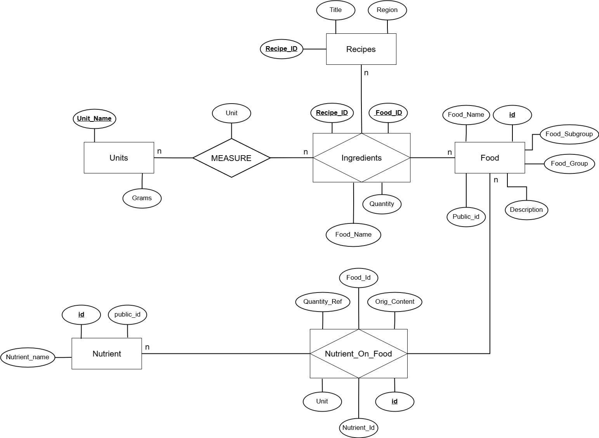
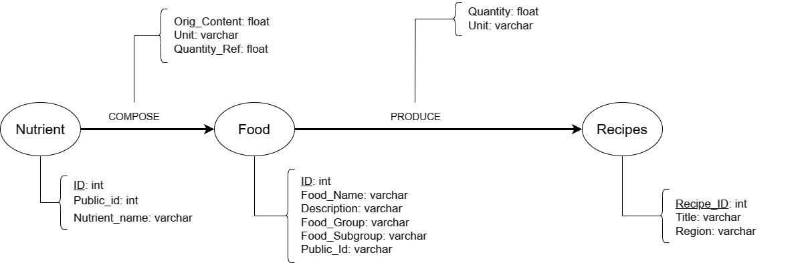

# Modelo de Apresentação da Final

# Modelo para Apresentação da Entrega Final do Projeto

## Motivação e Contexto

> O projeto proposto tem como foco central a investigação da composição e análise das receitas culinárias de diferentes regiões do mundo, visando compreender e mapear os macronutrientes presentes em cada prato. A motivação por trás desse estudo concentra-se na crescente conscientização sobre a importância da alimentação para a saúde, bem como na compreensão da diversidade gastronômica global. Dessa maneira, este projeto visa também entender como a concentração de determinado macronutriente se relaciona com os hábitos alimentares, contexto histórico e geográfico de cada região, contribuindo para uma compreensão mais profunda da relação entre alimentação e saúde.

## Slides

### Apresentação Prévia
> Coloque aqui o link para o PDF da apresentação prévia

### Apresentação Final
> Coloque aqui o link para o PDF da apresentação final

## Modelo Conceitual

> 

## Modelos Lógicos

- Modelo Lógico Relacional
~~~
Nutrient(_ID_, Public_id, Nutrient_name)

Food(_ID_, Public_id, Food_name, description, food_group, food_subgroup)

Nutrient_On_Food(_ID_, nutrient_ID, food_ID, Orig_Content, unit, quantity_Ref)
  nutrient_ID: chave estrangeira para Nutrient
  food_ID: chave estrangeira para Food

Recipes(_Recipe_ID_, Title, Region)

Units(_Unit_Name_, grams)

Ingredients(_Recipe_ID_, _Food_ID_, quantity, food_name, unit)
  Recipe_ID: chave estrangeira para Recipes
  Food_ID: chave estrangeira para Food
  Unit: chave estrangeira para Units
~~~

- Modelo Lógico de Grafos
> 

## Dataset Publicado
> Se ao tratar e integrar os dados originais foram produzidas novas bases relacionais ou de grafos, elencar essas bases.

título do arquivo/base | link | breve descrição
----- | ----- | -----
`Recipes` | [data/interim/Recipes.csv](https://github.com/lamevv/projeto/blob/main/project-2-final/data/interim/Recipes.csv) | `Informações das receitas, incluindo a descrição da receita e a região à qual ela pertence`
`ProcessedNutrient` | [data/interim/ProcessedNutrient.csv](https://github.com/lamevv/projeto/blob/main/project-2-final/data/interim/ProcessedNutrient.csv) | `Especificação e descrição dos nutrientes considerados na análise da composição dos ingredientes`
`Units-Conversion` | [data/interim/Units-Conversion.csv](https://github.com/lamevv/projeto/blob/main/project-2-final/data/interim/Units-Conversion.csv) | `Unidades de medida adotadas para a análise da composição de cada ingrediente em uma receita, acompanhada de seus valores padrão expressos em gramas`
`IngredientOnFood` | [data/interim/IngredientOnFood.csv](https://raw.githubusercontent.com/lamevv/projeto/main/project-2-final/data/interim/IngredientOnFood.csv) | `Detalhamento da composição de cada receita, listando ingredientes acompanhados de suas respectivas quantidades e unidade de medida`
`ProcessedContent` | [data/interim/ProcessedContent.csv](https://github.com/lamevv/projeto/blob/main/project-2-final/data/interim/ProcessedContent.csv) | `Avalia a concentração específica de nutrientes em cada ingrediente para uma quantidade de referência`
`MostFrequentIngredients` | [data/processed/MostFrequentIngredients.csv](https://github.com/lamevv/projeto/blob/main/project-2-final/data/processed/MostFrequentIngredients.csv) | `Exibe a frequência de ocorrência dos alimentos mais comuns em receitas de cada uma das regiões definidas pelo CulinaryDB`
`RecipeProfile` | [data/processed/RecipeProfile.csv](https://raw.githubusercontent.com/lamevv/projeto/main/project-2-final/data/processed/RecipeProfile.csv) | `Apresenta o perfil de cada receita em termos de macronutrientes (proteínas, carboidratos e gorduras), identificando aquelas que são nutricionalmente equilibradas`
`RegionalNutricionalProfile` | [data/processed/RegionalNutricionalProfile.csv](https://github.com/lamevv/projeto/blob/main/project-2-final/data/processed/RegionalNutricionalProfile.csv) | `Dispõe o perfil nutricional em termos de macronutrientes (proteínas, carboidratos e gorduras) das regiões definidas pelo CulinaryDB`
`food-graphs` | [data/graphs/food-graphs.csv](https://github.com/lamevv/projeto/blob/main/project-2-final/data/graphs/food-graphs.csv) | `Dispõe dos campos "id" e "name" da tabela Food. Tem como principal objetivo minimizar o volume de dados na criação do banco de dados em grafos`
`nutrient-graphs` | [data/graphs/nutrient-graphs.csv](https://github.com/lamevv/projeto/blob/main/project-2-final/data/graphs/nutrient-graphs.csv) | `Dispõe dos campos "id" e "name" da tabela Nutrient. Tem como principal objetivo minimizar o volume de dados na criação do banco de dados em grafos`

> Os arquivos finais do dataset publicado devem ser colocados na pasta `data`, em subpasta `processed`. Outros arquivos serão colocados em subpastas conforme seu papel (externo, interim, raw). A diferença entre externo e raw é que o raw é em formato não adaptado para uso. A pasta `raw` é opcional, pois pode ser substituída pelo link para a base original da seção anterior.
> Coloque arquivos que não estejam disponíveis online e sejam acessados pelo notebook. Relacionais (usualmente CSV), XML, JSON e CSV ou triplas para grafos.
> Este é o conjunto mínimo de informações que deve constar na disponibilização do Dataset, mas a equipe pode enriquecer esta seção.

## Bases de Dados

título da base | link | breve descrição
----- | ----- | -----
`FooDB` | <a href='https://foodb.ca'>`https://foodb.ca`</a> | `Descrição nutricional em macro e micronutrienes dos ingredientes`
`CulinaryDB` | <a href='https://cosylab.iiitd.edu.in/culinarydb/'>`https://cosylab.iiitd.edu.in/culinarydb`</a> | `Composição de receitas regionais, detalhando ingredientes e suas quantidades correspondentes`

## Detalhamento do Projeto
> Apresente aqui detalhes do processo de construção do dataset e análise. Nesta seção ou na seção de Perguntas podem aparecer destaques de código como indicado a seguir. Note que foi usada uma técnica de highlight de código, que envolve colocar o nome da linguagem na abertura de um trecho com `~~~`, tal como `~~~python`.
> Os destaques de código devem ser trechos pequenos de poucas linhas, que estejam diretamente ligados a alguma explicação. Não utilize trechos extensos de código. Se algum código funcionar online (tal como um Jupyter Notebook), aqui pode haver links. No caso do Jupyter, preferencialmente para o Binder abrindo diretamente o notebook em questão.

> Aqui devem ser apresentadas as operações de construção do dataset:
* extração de dados de fontes não estruturadas como, por exemplo, páginas Web
* agregação de dados fragmentados obtidos a partir de API
* integração de dados de múltiplas fontes
* tratamento de dados
* transformação de dados para facilitar análise e pesquisa

> Se for notebook, ele estará dentro da pasta `notebook`. Se por alguma razão o código não for executável no Jupyter, coloque na pasta `src` (por exemplo, arquivos do Orange ou Cytoscape). Se as operações envolverem queries executadas atraves de uma interface de um SGBD não executável no Jupyter, como o Cypher, apresente na forma de markdown.

- Transformação e adequação dos dados das receitas do `CulinaryDB`

A fim de criar a tabela `Recipes.csv`, foram executadas etapas de filtragem e renomeação das colunas, selecionando informações relevantes para as análises planejadas. Além disso, houve a modificação de certos valores, visando à normalização e padronização dos dados referentes às diferentes regiões associadas às receitas.

~~~python
import pandas as pd

# Leitura da tabela de receitas do CulinaryDB através de um DataFrame
df_recipes = pd.read_csv('../data/raw/culinarydb/01_Recipe_Details.csv', sep=',', header=0, encoding='UTF-8')

# Filtragem e renomeação das colunas com informações relevantes
df_recipes = df_recipes.rename(columns={'Cuisine': 'Region'})[['Recipe ID', 'Title', 'Region']]

# Padronização/Normalização de regiões específicas
df_recipes['Region'] = df_recipes['Region'].apply(lambda x: x.replace('Misc.: ', ''))
df_recipes['Region'] = df_recipes['Region'].apply(lambda x: x.replace('DACH Countries', 'Germany, Austria, and Switzerland'))

# Exportação dos dados processados para o formato csv (Recipes.csv)
df_recipes.to_csv('../data/interim/Recipes.csv', index=False)
~~~

- Tratamento dos dados da composição das receitas do `CulinaryDB`

A tabela [04_Recipe-Ingredients_Aliases](https://raw.githubusercontent.com/lamevv/projeto/main/project-2-final/data/raw/culinarydb/04_Recipe-Ingredients_Aliases.csv) do `CulinaryDB` não segue uma padronização específica para apresentar a participação de um ingrediente em uma dada receita, condensando toda essa informação em um texto no atributo `Original Ingredient Name`. Alguns dos formatos apresentados são: *3/4 cup mayonnaise*, *1 tablespoon butter*, *2 (4 ounce) skinless, boneless chicken breast halves*, *1 1/2 pounds ground beef*, entre outros. 

Desse modo, no notebook [units-of-measurement-data](https://github.com/lamevv/projeto/blob/main/project-2-final/notebooks/units-of-measurement-data.ipynb) foram realizadas uma série de extrações e normalizações para identificar a **quantidade** e **unidade de medida** referentes a participação dos ingredientes nas receitas. Além disso, o *notebook* detalha a elaboração da **tabela de unidades de medida**, em que cada unidade selecionada possui uma equivalência padrão em gramas, simplificando e padronizando o processo de verificação da presença dos ingredientes nas receitas. Assim, no final do tratamento dos dados, duas novas tabelas foram criadas `Recipe-Ingredients-With-Quantity.csv` e `Units-Conversion.csv`.

- Integração dos dados de ingredientes do `FooDB` com o `CulinaryDB`

Inicialmente, importamos as tabelas de ingredientes por meio de *DataFrames*, as quais seriam integradas.

~~~python
import pandas as pd

# Importação dados processados com quantidade e unidade de medida dos ingredientes nas receitas (CulinaryDB)
df_with_unit = pd.read_csv('../data/interim/Recipe-Ingredients-With-Quantity.csv', sep=',', header=0, encoding='UTF-8')

# Renomeação das colunas
df_with_unit = df_with_unit.rename(columns={'Recipe ID': 'Recipe_ID', 'Original Ingredient Name': 'Original_Ingredient_Name', 'Aliased Ingredient Name': 'Aliased_Ingredient_Name', 'Entity ID': 'Entity_ID'})

# Importação da tabela Food.csv com os dados dos ingredientes do FooDB
df_food = pd.read_csv('Food.csv', sep=',', header=0, encoding='UTF-8')

# Filtragem das colunas com informações relevantes para a integração
df_food = df_food[['id', 'name']]
~~~

Para criar a coluna `Food_ID` no arquivo das receitas, foi necessário iterar por cada linha do `Recipe-Ingredients-With-Quantity` e verificar se o ingrediente da linha tinha correspondência com algum alimento do `FoodDB`. Se houvesse uma correspondência, o ID do alimento seria retornado; caso contrário, seria retornado `None`. Alguns alimentos não encontraram correspondência e, consequentemente, ficaram com `NaN` na coluna `Food_ID`, levando à exclusão desses registros.

~~~python
def get_food_id(food_name):
    filtered = df_food[df_food['name'].str.contains(food_name, case=False)]
    if not filtered.empty:
        return filtered.iloc[0]['id']
    return None

df_with_unit['Food_ID'] = df_with_unit['Aliased_Ingredient_Name'].apply(get_food_id)

# Filtragem das colunas com informações relevantes e exclusão dos registros com NaN
df_with_unit = df_with_unit.dropna()[['Recipe_ID', 'Food_ID', 'Aliased_Ingredient_Name', 'Quantity', 'Unit']]

# Exportação dos dados processados para o formato csv (IngredientOnFood.csv)
df_with_unit.to_csv('../data/interim/IngredientOnFood.csv', index=False)
~~~

## Evolução do Projeto
> Relatório de evolução, descrevendo as evoluções na modelagem do projeto, dificuldades enfrentadas, mudanças de rumo, melhorias e lições aprendidas. Referências aos diagramas, modelos e recortes de mudanças são bem-vindos.
> Podem ser apresentados destaques na evolução dos modelos conceitual e lógico. O modelo inicial e intermediários (quando relevantes) e explicação de refinamentos, mudanças ou evolução do projeto que fundamentaram as decisões.
> Relatar o processo para se alcançar os resultados é tão importante quanto os resultados.

## Perguntas de Pesquisa/Análise Combinadas e Respectivas Análises

> Apresente os resultados da forma mais rica possível, com gráficos e tabelas. Mesmo que o seu código rode online em um notebook, copie para esta parte a figura estática. A referência a código e links para execução online pode ser feita aqui ou na seção de detalhamento do projeto (o que for mais pertinente).

> Liste aqui as perguntas de pesquisa/análise e respectivas análises. Nem todas as perguntas precisam de queries que as implementam. É possível haver perguntas em que a solução é apenas descrita para demonstrar o potencial da base. Abaixo são ilustradas três perguntas, mas pode ser um número maior a critério da equipe.
>
### Perguntas/Análise com Resposta Implementada

> As respostas às perguntas podem devem ser ilustradas da forma mais rica possível com tabelas resultantes, grafos ou gráficos que apresentam os resultados. Os resultados podem ser analisados e comentados. Veja um exemplo de figura ilustrando uma comunidade detectada no Cytoscape:

> 

#### Pergunta/Análise 1
> * Quais são os alimentos mais presentes nas receitas de cada região?
>   
>   * Utilizando funções de agregamento, descobrimos o quão frequente é um ingrediente na composição dos alimentos de uma região. Dessa forma, definindo-se os parâmetros, pegamos aqueles que tinham frequências acima da média das frequências relacionadas à cada região. O resultado foi que obtivemos alimentos que são muito populares, como ovo, pão e água.

~~~SQL
DROP VIEW IF EXISTS MostFrequentIngredients;

CREATE VIEW MostFrequentIngredients AS
SELECT F.Region, I.Food_Id, I.Food_Name, COUNT(Food_Id) frequencia
    FROM (SELECT Region, AVG(frequencia) std_frequencia, STDDEV(frequencia) desvpad_frequencia
                FROM (SELECT Region, Food_Id, COUNT(Food_Id) frequencia
                      FROM Recipes R JOIN Ingredients I ON R.Recipe_Id = I.Recipe_Id
                      GROUP BY Region, Food_Id
                      ORDER BY Region, frequencia DESC) F
          GROUP BY Region) F, Recipes R, Ingredients I
    WHERE  R.Region = F.Region AND R.Recipe_Id=I.Recipe_Id
    GROUP BY F.Region, I.Food_Id, I.Food_Name
    HAVING COUNT(Food_Id) >= std_frequencia + desvpad_frequencia
    ORDER BY frequencia DESC;
~~~

#### Pergunta/Análise 2
> * Quais os alimentos e receitas que mais contribuem para a ingestão de açúcares, gorduras e proteínas para cada região?
>   
>   * Traçamos um perfil nutricional de cada receita, que contém informações dos macronutrientes (proteínas, gorduras e carboidratos) presentes. A partir disso, podemos filtrar receitas com altos teores desses macronutrientes, de acordo com a região.

~~~SQL
CREATE TABLE Recipe_Profile (
    Recipe_Id INT NOT NULL,
    weight FLOAT DEFAULT 0,
    fat FLOAT DEFAULT 0,
    carbo FLOAT DEFAULT 0,
    protein FLOAT DEFAULT 0,
    PRIMARY KEY(Recipe_Id),
    FOREIGN KEY(Recipe_Id)
        REFERENCES Recipes(Recipe_Id)
            ON UPDATE NO ACTION
            ON DELETE NO ACTION
);
~~~

~~~SQL
UPDATE Recipe_Profile RP
SET RP.fat = (SELECT COALESCE(SUM(RIF.fat), 0) FROM RecipeIngredientFat RIF WHERE RIF.Recipe_Id = RP.Recipe_Id),
    RP.protein = (SELECT COALESCE(SUM(RIP.protein), 0) FROM RecipeIngredientProtein RIP WHERE RIP.Recipe_Id = RP.Recipe_Id),
    RP.carbo = (SELECT COALESCE(SUM(RIC.carbo), 0) FROM RecipeIngredientCarbo RIC WHERE RIC.Recipe_Id = RP.Recipe_Id),
    RP.weight = (SELECT COALESCE(SUM(RI.qnt_grams), 0) FROM RecipeIngredients RI WHERE RI.Recipe_Id = RP.Recipe_Id);
~~~

#### Pergunta/Análise 3
> * Quais são as receitas mais equilibradas em termos de macronutrientes (proteínas, gorduras e carboidratos) para cada região? 
>   
>   * Através do perfil nutricional de cada receita, podemos definir se a receita é balanceada com base em parâmetros padrões de proteínas, gorduras e carboidratos. Na nossa análise, consideramos balanceado uma receita que seja composta com até 10% de gordura, 50% de carboidrato e pelo menos 10% de proteína.

~~~SQL
DROP VIEW IF EXISTS RecipeProfileComplete;

CREATE VIEW RecipeProfileComplete AS
SELECT R.Recipe_Id, R.Title, R.Region, RP.weight recipe_weight, RP.fat total_fat, RP.fat/RP.weight per_fat,
        RP.carbo total_carbo, RP.carbo/RP.weight per_carbo, RP.protein total_protein, RP.protein/RP.weight per_protein,
        (RP.fat / RP.weight <= 0.1
         AND RP.carbo / RP.weight <= 0.5
         AND RP.protein / RP.weight >= 0.1) AS equilibrado
    FROM Recipes R, Recipe_Profile RP
    WHERE R.Recipe_Id = RP.Recipe_Id
    GROUP BY R.Recipe_Id
    ORDER BY Region;
~~~

#### Pergunta/Análise 4
> * Existe um diferença entre o perfil nutricional de diferentes regiões, de modo que uma seja mais balanceada do que a outra?
>   
>   * Traçando um perfil nutricional de cada região, com base nas receitas consumidas, foi possível constatar que o perfil nutricional das regiões, em geral, convergem para um perfil, dado que os valores de desvio padrão da quantidade de macronutrientes é pequeno.

~~~SQL
CREATE TABLE Region_Profile (
    Region VARCHAR(50),
    Food_Total_Weight_Kg FLOAT DEFAULT 0,
    Total_Fat FLOAT DEFAULT 0,
    Total_Protein FLOAT DEFAULT 0,
    Total_Carbo FLOAT DEFAULT 0,
    Per_Fat FLOAT DEFAULT 0,
    Per_Protein FLOAT DEFAULT 0,
    Per_Carbo FLOAT DEFAULT 0,
    PRIMARY KEY(Region)
);
~~~
~~~SQL
UPDATE Region_Profile RP
SET
    Food_Total_Weight_Kg = (SELECT COALESCE(SUM(RPC.recipe_weight/1000), 0) FROM RecipeProfileComplete RPC WHERE RPC.Region = RP.Region),
    Total_Fat = (SELECT COALESCE(SUM(RPC.total_fat/1000), 0) FROM RecipeProfileComplete RPC WHERE RPC.Region = RP.Region),
    Total_Carbo = (SELECT COALESCE(SUM(RPC.total_carbo/1000), 0) FROM RecipeProfileComplete RPC WHERE RPC.Region = RP.Region),
    Total_Protein = (SELECT COALESCE(SUM(RPC.total_protein/1000), 0) FROM RecipeProfileComplete RPC WHERE RPC.Region = RP.Region);

UPDATE Region_Profile RP
SET
    Per_Protein = Total_Protein/Food_Total_Weight_Kg,
    Per_Fat = Total_Fat/Food_Total_Weight_Kg,
    Per_Carbo = Total_Carbo/Food_Total_Weight_Kg; 
~~~

~~~SQL
SELECT STDDEV(Per_Fat) DSP_Fat, AVG(Per_Fat) AVG_Fat,
        STDDEV(Per_Protein) DSP_Protein, AVG(Per_Protein) AVG_Protein,
        STDDEV(Per_Carbo) DSP_Carbo, AVG(Per_Carbo) AVG_Carbo FROM Region_Profile;
~~~

### Perguntas/Análise Propostas mas Não Implementadas

#### Pergunta/Análise 1
> * Quais são as diferenças na distribuição de macronutrientes entre receitas de diferentes regiões do mundo?
>   
>   * Utilizando métricas estatísticas, é viável examinar a distribuição dos macronutrientes (carboidratos, açúcares e proteínas) entre as diversas regiões abordadas no estudo. A análise dos padrões alimentares globais não apenas proporciona um entendimento mais profundo da diversidade culinária, mas também suas implicações na saúde. Esse estudo pode contribuir na formulação de dietas personalizadas e específicas, ao mesmo tempo em que enriquece a compreensão dos hábitos alimentares em escala mundial.

#### Pergunta/Análise 2
> * Quais são os principais ingredientes e padrões de dietas que caracterizam regiões com baixos índices de doenças crônicas?
>   
>   * Ao analisar as distribuições de macronutrientes entre diferentes regiões e correlacionar esses dados com informações auxiliares sobre os índices de doenças crônicas em países ou regiões específicas, é possível conduzir uma análise que orienta políticas de saúde pública e diretrizes sobre novas dietas, oferecendo um ponto de partida para intervenções e estratégias de promoção da saúde.

#### Pergunta/Análise 3
> * [Grafos] Qual o perfil nutricional de cada receita baseado na centralidade de alimentos em uma região
>   
>   * Seria possível construir uma relação entre nós do tipo Food, em que dois nós conectam quando seus respectivos alimentos aparecem em uma mesma receita de uma mesma região. A partir de tal relação, seria calculado o Degree Centrality do grafo, elencando os alimentos de maior relevância (em termos de conexões) de uma região, o que possibilita a construção de um perfil nutricional da região baseado nos alimentos mais populares.

#### Pergunta/Análise 4
> * É possível construir uma relação entre o perfil nutricional das regiões?
>   
>   * A partir da relação entre nós mencionada na pergunta acima, poderíamos utilizar o conceito de Comunidade, a fim de identificar comunidade de alimentos nos grafos. Assim, seria possível verificar se alguma comunidade representa uma interseção do conjuntos de alimentos de regiões distintas. Tal interseção seria um indício de uma possível relação do perfil nutricional de tais regiões.

> Coloque um link para o arquivo do notebook que executa o conjunto de queries. Ele estará dentro da pasta `notebook`. Se por alguma razão o código não for executável no Jupyter, coloque na pasta `src`. Se as queries forem executadas atraves de uma interface de um SGBD não executável no Jupyter, como o Cypher, apresente na forma de markdown.
